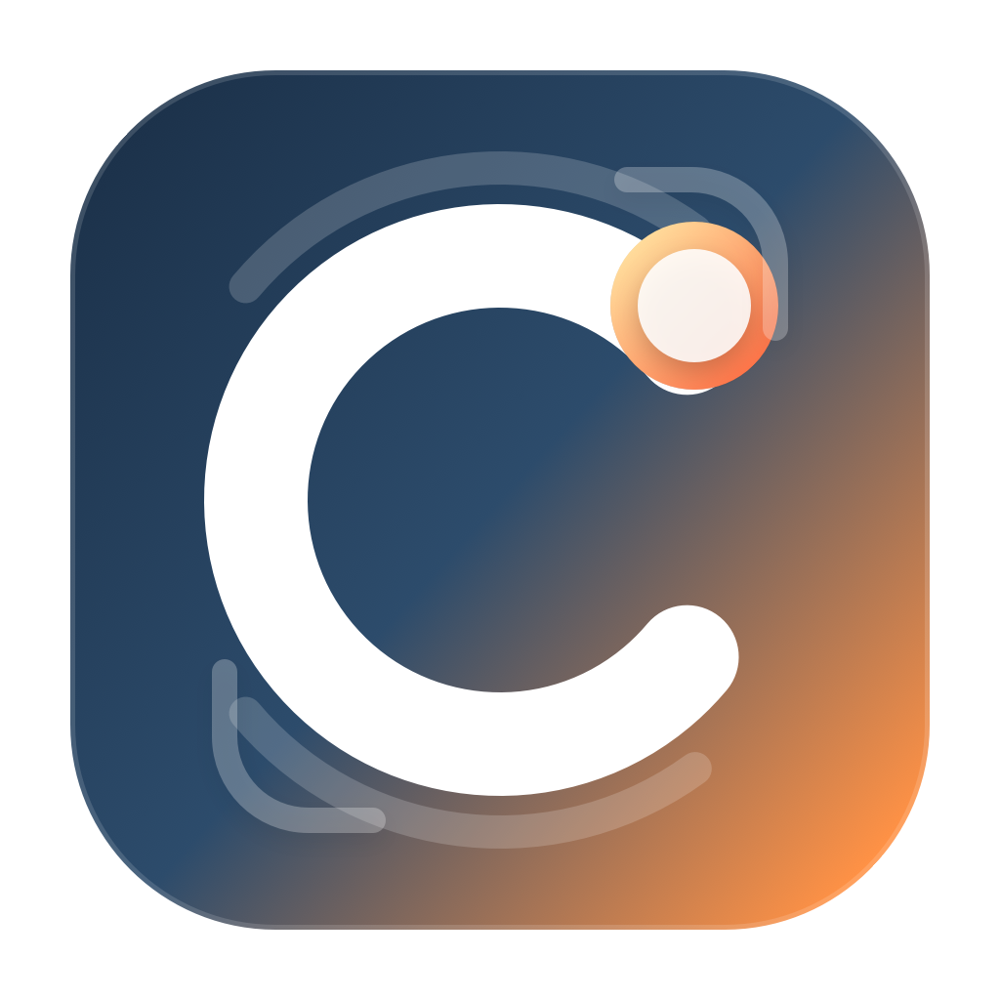
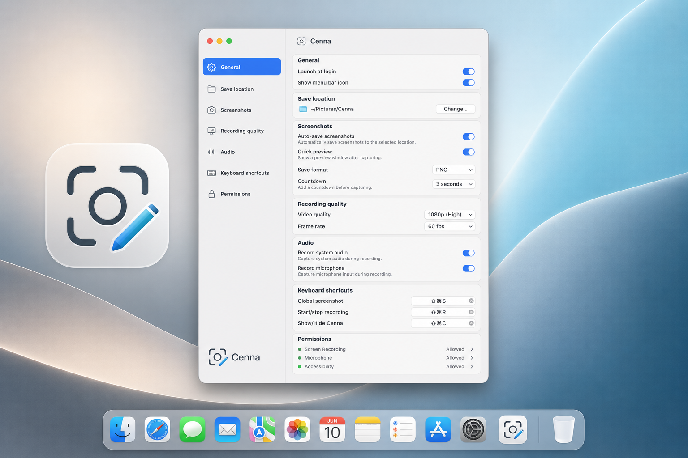

# Cenna

### Screenshots and screen recording that feel like part of macOS.

Native capture. A real annotation editor. Video recording with system audio, mic and webcam — all from the menu bar, in an app that idles at **~15 MB of RAM**.

**[⬇︎  Download for macOS](https://github.com/lucasmancan/Cenna/releases/latest)**

Free · macOS 13+ · Apple Silicon & Intel

---

## Why Cenna

Most capture tools are either too basic (the built-in shortcut) or too heavy (Electron apps that eat hundreds of megabytes and clutter your Mac). Cenna sits exactly in between: **the polish of a paid tool, the footprint of a native one.**

- **📸 Capture anything, fast** — full screen, a specific window, or drag out an exact region. Global hotkeys, optional countdown, instant preview.
- **✏️ Annotate before you save** — arrows, rectangles, ellipses, freehand, and **blur/pixelate** to hide sensitive info. What you see in the editor is pixel-exact to what gets written.
- **🎥 Record real video** — MP4 (H.264) with system audio, microphone, and a webcam overlay — or export a clean looping **GIF**.
- **✂️ Edit your recording** — split at the playhead, trim by deleting segments, and speed up the slow parts (1×–2×), per segment or all at once, with an export-accurate preview.
- **🪶 Absurdly light** — lives in the menu bar, no Dock icon, no bloat. Screenshots are captured out-of-process so full-res bitmaps never sit in memory. Idle footprint stays around **15 MB**.
- **🔒 Yours, locally** — files save straight to your folder. No account, no cloud, no telemetry.

---

## Install

1. **[Download the latest `.dmg`](https://github.com/lucasmancan/Cenna/releases/latest)**
2. Open it and drag **Cenna** into **Applications**.
3. Launch it — Cenna appears in your menu bar (there's no Dock icon; look at the top-right).

### First launch — opening an app from an unidentified developer

Cenna isn't notarized by Apple yet, so on the **first launch** macOS shows a warning
like *"Cenna can't be opened because it is from an unidentified developer"* or
*"Apple could not verify Cenna is free of malware."* This is expected — do this **once**:

**The reliable way (any macOS):**

1. In **Applications**, **right-click** (or Control-click) **Cenna** → **Open**.
2. In the dialog that appears, click **Open** again.
3. Done — macOS remembers your choice; every launch after this is a normal double-click.

> Double-clicking the first time will **not** show the Open button — you must use
> right-click → Open. It only needs to be done once.

**macOS 15 (Sequoia) and later**, if right-click → Open doesn't offer an Open button:

1. Try to open Cenna once (let it get blocked), then go to
   **System Settings → Privacy & Security**.
2. Scroll down to the Security section — you'll see *"Cenna was blocked…"* with an
   **Open Anyway** button. Click it, then confirm.

### Permissions

Cenna will ask for **Screen Recording** (required for capture/recording) and, if you use
them, **Microphone** and **Camera**. Grant them in **System Settings → Privacy & Security**.
You only do this once.

---

## FAQ

**Is it really free?** Yes — no license, no trial, no nag.

**Why the security warning?** The app isn't yet notarized through Apple's paid Developer
program. The one-time right-click → Open above is all you need. Notarization is planned.

**Does it phone home?** No. No account, no analytics, no network calls for the app to work.

**Where are my files saved?** A folder you choose in Settings (defaults to `~/Pictures/Cenna`).
You can also have it ask every time.

---

More at **[mancan.digital/products/cenna.html](https://mancan.digital/products/cenna.html)**

This repository hosts release downloads only — the source is private. © Mancan Digital.

